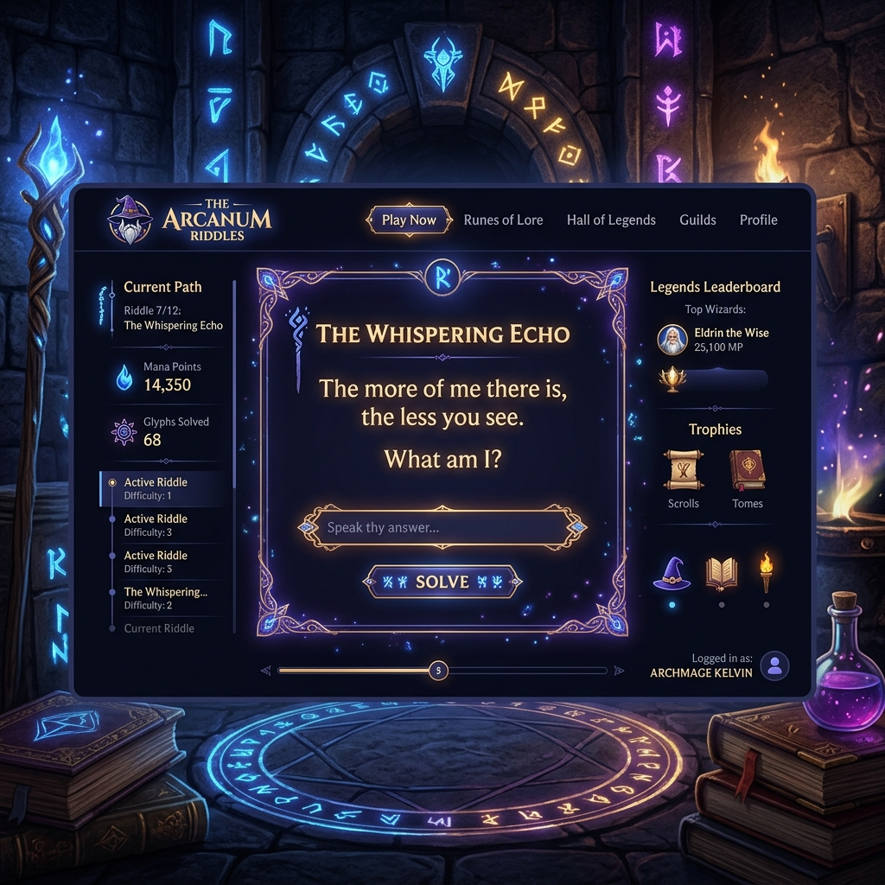

# 🧙‍♂️ Magos — Plataforma de Charadas Mágicas

> Decifre · Progrida · Conquiste

Magos é uma plataforma gamificada de charadas onde usuários criam, compartilham e resolvem enigmas enquanto sobem de nível, ganham badges e competem em um ranking global. Empresas podem usar o sistema para engajar clientes com charadas físicas via QR Code — em caixas de pizza, cardápios, flyers e muito mais.

---

## 📸 Preview



---

## ✨ Funcionalidades

### 🔐 Autenticação & Perfis

- Cadastro com e-mail e senha
- Login com sessão persistente (localStorage)
- Dois tipos de conta:
  - **Pessoa Física** — jogador individual
  - **Empresa** — conta corporativa com nome da empresa
- Avatares em emoji personalizáveis
- Controle de acesso por função (`user` / `admin`)

---

### 🎮 Sistema de Gamificação

#### Níveis e XP

O jogador evolui por **15 títulos** conforme acumula XP:

| Nível | Título |
|-------|--------|
| 1 | ⭐ Aprendiz |
| 2 | ⭐ Novato |
| 3 | ⭐ Iniciado |
| 4 | 🌟 Explorador |
| 5 | 🌟 Aventureiro |
| 6 | 🌟 Enigmista |
| 7 | 💫 Decifrador |
| 8 | 💫 Feiticeiro |
| 9 | 💫 Arquimago |
| 10 | ✨ Sábio |
| 11 | ✨ Lendário |
| 12 | ✨ Mítico |
| 13 | 🌠 Oráculo |
| 14 | 🌠 Transcendente |
| 15 | 🌠 Mago Supremo |

**Como ganhar XP:**
- Resolver uma charada → +pontos conforme a dificuldade
- Criar uma charada → +30 XP

#### Dificuldades e Pontos

| Nível | Ícone | Pontos |
|-------|-------|--------|
| Fácil | ⭐ | 50 pts |
| Médio | ⭐⭐ | 100 pts |
| Difícil | ⭐⭐⭐ | 150 pts |
| Expert | ⭐⭐⭐⭐ | 200 pts |
| Lendário | ⭐⭐⭐⭐⭐ | 300 pts |

#### Streak de Dias

- Contador de dias consecutivos jogando 🔥
- Reinicia se o jogador pular um dia
- Exibido no painel do usuário

#### Badges / Conquistas

5 conquistas desbloqueáveis:

| Badge | Condição |
|-------|----------|
| 👣 Primeiro Passo | Resolver a 1ª charada |
| 🪄 Decifrador | Resolver 10 charadas |
| 📜 Criador | Criar 10 charadas |
| 🔥 Sete Dias | 7 dias de streak consecutivo |
| ⚡ Ascensão | Atingir o nível 5 |

---

### 📜 Charadas

#### Atributos de uma Charada

- **Pergunta** — até 500 caracteres
- **Resposta** — comparação sem diferença de maiúsculas/minúsculas
- **Dica** — opcional, revelada pelo jogador quando quiser
- **Dificuldade** — 1 a 5 estrelas
- **Categoria** — 6 opções
- **Tags** — palavras-chave separadas por vírgula

#### Categorias

| Categoria | Ícone |
|-----------|-------|
| Clássica | 📜 |
| Criativa | 🎨 |
| Lógica | 🧮 |
| Cultural | 🌍 |
| Humor | 😄 |
| Geral | 🎲 |

#### Charada Mensal 🏆

- Uma charada especial com **prêmio em dinheiro** acumulado (padrão R$ 500)
- Nível mínimo configurável para participar
- Prazo com **contador regressivo** em tempo real
- Gerenciada pelo admin pelo painel

---

### 🕹️ Resolver Charadas

- Até **3 tentativas** por charada
- Indicador visual de tentativas (pontos)
- Animação de shake em resposta errada
- Revelação de dica opcional (💡)
- Exibe XP ganho ao acertar
- Visitantes (não logados) veem CTA de login/cadastro

---

### ➕ Criar Charadas

- Formulário com **preview ao vivo** da charada
- Contador de caracteres em tempo real
- Seleção visual de dificuldade (cores por nível)
- Seleção de categoria por grid com emojis
- Validação de campos obrigatórios

---

### 🔍 Explorar Charadas

- **Busca** por texto (pergunta e tags)
- **Filtros** por categoria
- **Ordenação** por: Recentes · Populares · Mais Fáceis · Mais Difíceis
- Cards com preview da pergunta, dificuldade, pontos, visualizações e resoluções
- Indicador visual se o usuário já resolveu a charada (✅)

---

### 🏆 Ranking

- Algoritmo: `level × 10.000 + xp`
- **Pódio** para os 3 primeiros com medalhas 🥇🥈🥉
- Lista completa dos jogadores com avatar, nome, empresa, nível e XP
- Destaque do usuário logado no ranking
- Exibe a posição atual do jogador

---

### 📊 Painel do Usuário

- Avatar, nível e título
- Barra de progresso de XP para o próximo nível
- Streak de dias (🔥)
- Estatísticas: charadas criadas, resolvidas, XP total, conquistas
- **Abas:**
  - 📜 Minhas Charadas — lista com ações
  - 🏅 Conquistas — badges com status
  - ⚡ Atividade Recente — últimas 10 respostas (✅/❌)
  - 🏆 Charada Mensal — participação e countdown

---

### 📱 QR Code & Impressão

- Cada charada tem um **QR Code único** gerado automaticamente
- QR leva diretamente à página da charada
- Página de impressão otimizada para papel A4
- Layout estilizado com bordas, logo e tagline
- Botões de **download PNG** e **imprimir**
- **Compartilhamento via WhatsApp** com link direto
- Ideal para: caixas de pizza, cardápios, panfletos, materiais de marketing

---

### ⚙️ Painel Admin

- Configurar o valor do prêmio mensal (R$)
- Definir nível mínimo para participar da charada mensal
- Definir prazo da charada mensal

---

## 🗃️ Banco de Dados de Enigmas

O projeto inclui **772 enigmas prontos para importar**:

| Arquivo | Idioma | IDs | Quantidade |
|---------|--------|-----|-----------|
| `database/schema.sql` | — | — | Schema completo |
| `database/riddles_seed.sql` | 🇺🇸 Inglês | rdl_001 – rdl_286 | 286 |
| `database/riddles_seed_pt.sql` | 🇧🇷 Português | rdl_pt_001 – rdl_pt_286 | 286 |
| `database/riddles_seed_extra.sql` | 🇺🇸 + 🇧🇷 | rdl_287 – rdl_486 / rdl_pt_287 – rdl_pt_486 | 400 |

Categorias cobertas: `natureza`, `animais`, `objetos`, `alimentos`, `abstrato`

---

## 🛠️ Tecnologias

| Camada | Tecnologia |
|--------|-----------|
| Frontend | HTML5, CSS3, JavaScript (Vanilla) |
| Backend | PHP 8+ com PDO |
| Banco de dados | MySQL / MariaDB (utf8mb4) |
| QR Code | [qrcode.js](https://github.com/nicktindall/cyclon.p2p-rtc-client) |
| Hospedagem | Ezyro / qualquer servidor PHP + MySQL |

---

## 📁 Estrutura do Projeto

```
magos/
├── index.html              # Landing page
├── login.html              # Login
├── registro.html           # Cadastro
├── painel.html             # Dashboard do usuário
├── explorar.html           # Explorar charadas
├── ranking.html            # Ranking global
├── criar.html              # Criar charada
├── charada.html            # Resolver charada
├── imprimir.html           # Imprimir / QR Code
│
├── pages/                  # Cópias alternativas das páginas
├── api.php                 # API REST (entry point)
├── conexao.php             # Conexão com o banco (configurar aqui)
│
├── config/
│   ├── database.php        # Configuração alternativa do banco
│   └── .htaccess
│
├── database/
│   ├── schema.sql              # Schema MySQL completo
│   ├── riddles_seed.sql        # 286 enigmas em inglês
│   ├── riddles_seed_pt.sql     # 286 enigmas em português
│   └── riddles_seed_extra.sql  # 400 enigmas extras (EN + PT)
│
├── js/
│   ├── app.js              # Lógica principal da aplicação
│   └── qrcode.min.js       # Geração de QR Code
│
└── assets/
    ├── css/style.css
    ├── js/app.js
    └── magos-preview.png
```

---

## 🚀 Como Instalar

### 1. Clone o repositório

```bash
git clone https://github.com/lukasprog01/magos-vers-o-1.0.git
cd magos-vers-o-1.0
```

### 2. Configure o banco de dados

No seu painel de hospedagem (ex: Ezyro, cPanel), crie um banco MySQL e importe:

```bash
# 1. Schema (tabelas)
mysql -u SEU_USUARIO -p SEU_BANCO < database/schema.sql

# 2. Enigmas (opcional — escolha o idioma desejado)
mysql -u SEU_USUARIO -p SEU_BANCO < database/riddles_seed.sql      # inglês
mysql -u SEU_USUARIO -p SEU_BANCO < database/riddles_seed_pt.sql   # português
mysql -u SEU_USUARIO -p SEU_BANCO < database/riddles_seed_extra.sql # extras
```

Ou importe os arquivos `.sql` diretamente pelo **phpMyAdmin**.

### 3. Configure a conexão

Edite `conexao.php` com os dados do seu banco:

```php
$host   = 'SEU_HOST_BANCO';    // Ex: sql101.ezyro.com
$dbname = 'SEU_BANCO_MAGOS';   // Nome do banco criado
$user   = 'SEU_USUARIO_BANCO'; // Usuário do banco
$pass   = 'SUA_SENHA_BANCO';   // Senha definida no painel
```

### 4. Faça o upload

Envie todos os arquivos para a pasta `public_html` do seu servidor via FTP ou pelo gerenciador de arquivos do painel.

### 5. Acesse

Abra o navegador e acesse o domínio configurado. A conta admin padrão é:

```
E-mail: admin@magos.com
Senha:  admin123
```

> ⚠️ **Troque a senha do admin imediatamente após o primeiro acesso.**

---

## 🔌 API — Endpoints

Todos os endpoints passam por `api.php` com o parâmetro `action`.

| Action | Método | Descrição |
|--------|--------|-----------|
| `login` | POST | Autenticar usuário |
| `register` | POST | Cadastrar novo usuário |
| `getLeaderboard` | GET | Top usuários do ranking |
| `getPublicRiddles` | GET | Listar charadas (com filtros) |
| `getMyRiddles` | GET | Charadas criadas pelo usuário |
| `getRiddle` | GET | Detalhes de uma charada |
| `createRiddle` | POST | Criar nova charada |
| `answerRiddle` | POST | Submeter resposta |
| `hasAnswered` | GET | Verificar se usuário já respondeu |
| `updateViews` | GET | Incrementar visualizações |
| `getSettings` | GET | Configurações globais |
| `saveSettings` | POST | Salvar configuração (admin) |
| `getMonthlyRiddle` | GET | Charada mensal ativa |
| `getMyActivity` | GET | Histórico de respostas do usuário |

---

## 🎨 Design

- Paleta roxa/mágica com acentos em dourado e ciano
- Efeito de vidro (glassmorphism) nos cards
- Partículas animadas no fundo
- Responsivo para mobile e desktop
- Cores por dificuldade: verde · azul · amarelo · vermelho · roxo

---

## 📄 Licença

Projeto desenvolvido para portfólio. Livre para uso pessoal e educacional.

---

<p align="center">Feito com 🪄 por <a href="https://github.com/lukasprog01">lukasprog01</a></p>
